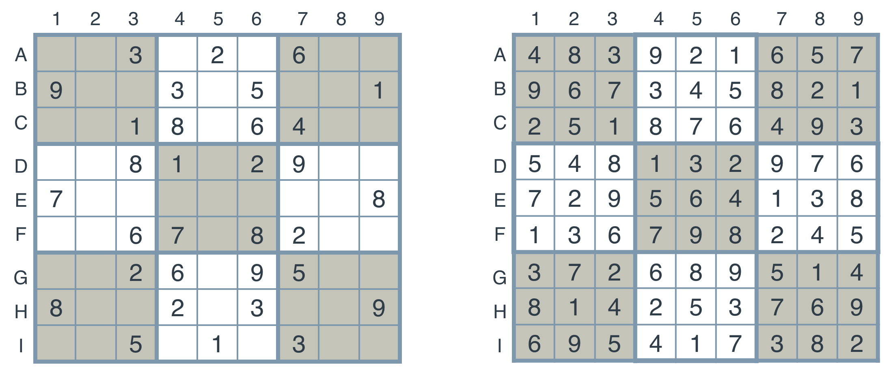
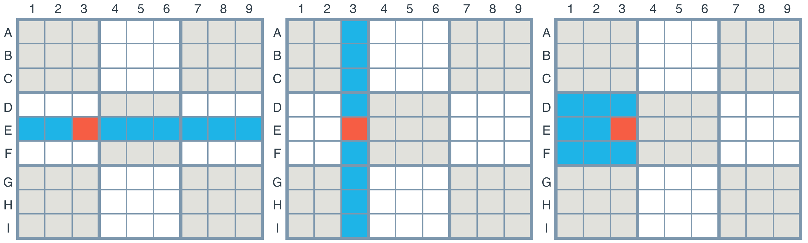

# Setting Up The Board

### Rows and Columns

Since we're writing an agent to solve the Sudoku puzzle, let's start by labelling rows and columns.

- The rows will be labelled by the letters A, B, C, D, E, F, G, H, I
- The columns will be labelled by the numbers 1, 2, 3, 4, 5, 6, 7, 8, 9. Here we can see the unsolved and solved puzzles with the labels for the rows and columns
- The 3x3 squares won't be labelled, but in the diagram, they can be seen with alternating colors of grey and white

### Boxes, Units and Peers

And let's start naming the important elements created by these rows and columns that are relevant to solving a Sudoku:

- The individual squares at the intersection of rows and columns will be called boxes. These boxes will have labels 'A1', 'A2', ..., 'I9'.
- The complete rows, columns, and 3x3 squares, will be called units. Thus, each unit is a set of 9 boxes, and there are 27 units in total.
- For a particular box (such as 'A1'), its peers will be all other boxes that belong to a common unit (namely, those that belong to the same row, column, or 3x3 square).

Let's see an example. In the grids below, the set of highlighted boxes represent units. Each grid shows a different peer of the box at E3.

