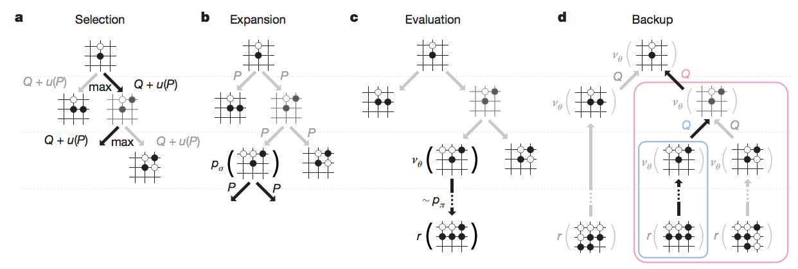
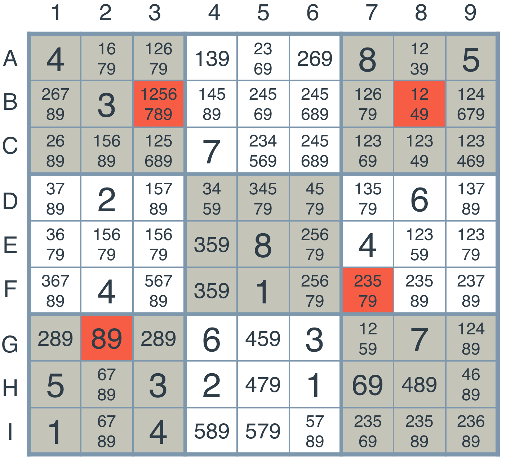

# Solution Strategy Three: Search



The above example of search is being used by Google's AlphaGo

We're now going to use another foundational AI technique to help us solve this problem: Search.

Search is used throughout AI from Game-Playing to Route Planning to efficiently find solutions.

Here's how we'll apply it. The box 'A2' has four possibilities: 1, 6, 7, and 9. Why don't we fill it in with a 1 and try to solve our puzzle. If we can't solve it, we'll try with a 6, then with a 7, and then with a 9. Sure, it's four times as much work, but each one of the cases becomes easier.

Actually, there's something a bit smarter than that. Looking carefully at the puzzle, is there a better choice for a box than **'A2'**?



We pick G2 because it has the fewest numbers to try out

***

###Intuition

**Pick a box with a minimal number of possible values. Try to solve each of the puzzles obtained by choosing each of these values, recursively.**

## Code

util.py

```python
rows = 'ABCDEFGHI'
cols = '123456789'

def cross(a, b):
    return [s+t for s in a for t in b]

boxes = cross(rows, cols)

row_units = [cross(r, cols) for r in rows]
column_units = [cross(rows, c) for c in cols]
square_units = [cross(rs, cs) for rs in ('ABC','DEF','GHI') for cs in ('123','456','789')]
unitlist = row_units + column_units + square_units
units = dict((s, [u for u in unitlist if s in u]) for s in boxes)
peers = dict((s, set(sum(units[s],[]))-set([s])) for s in boxes)

def display(values):
    """
    Display the values as a 2-D grid.
    Input: The sudoku in dictionary form
    Output: None
    """
    width = 1+max(len(values[s]) for s in boxes)
    line = '+'.join(['-'*(width*3)]*3)
    for r in rows:
        print(''.join(values[r+c].center(width)+('|' if c in '36' else '')
                      for c in cols))
        if r in 'CF': print(line)
    return

def grid_values(grid):
    """
    Convert grid into a dict of {square: char} with '123456789' for empties.
    Input: A grid in string form.
    Output: A grid in dictionary form
            Keys: The boxes, e.g., 'A1'
            Values: The value in each box, e.g., '8'. If the box has no value, then the value will be '123456789'.
    """
    chars = []
    digits = '123456789'
    for c in grid:
        if c in digits:
            chars.append(c)
        if c == '.':
            chars.append(digits)
    assert len(chars) == 81
    return dict(zip(boxes, chars))
    
def eliminate(values):
    """
    Go through all the boxes, and whenever there is a box with a value, eliminate this value from the values of all its peers.
    Input: A sudoku in dictionary form.
    Output: The resulting sudoku in dictionary form.
    """
    solved_values = [box for box in values.keys() if len(values[box]) == 1]
    for box in solved_values:
        digit = values[box]
        for peer in peers[box]:
            values[peer] = values[peer].replace(digit,'')
    return values

def only_choice(values):
    """
    Go through all the units, and whenever there is a unit with a value that only fits in one box, assign the value to this box.
    Input: A sudoku in dictionary form.
    Output: The resulting sudoku in dictionary form.
    """
    for unit in unitlist:
        for digit in '123456789':
            dplaces = [box for box in unit if digit in values[box]]
            if len(dplaces) == 1:
                values[dplaces[0]] = digit
    return values

def reduce_puzzle(values):
    """
    Iterate eliminate() and only_choice(). If at some point, there is a box with no available values, return False.
    If the sudoku is solved, return the sudoku.
    If after an iteration of both functions, the sudoku remains the same, return the sudoku.
    Input: A sudoku in dictionary form.
    Output: The resulting sudoku in dictionary form.
    """
    solved_values = [box for box in values.keys() if len(values[box]) == 1]
    stalled = False
    while not stalled:
        solved_values_before = len([box for box in values.keys() if len(values[box]) == 1])
        values = eliminate(values)
        values = only_choice(values)
        solved_values_after = len([box for box in values.keys() if len(values[box]) == 1])
        stalled = solved_values_before == solved_values_after
        if len([box for box in values.keys() if len(values[box]) == 0]):
            return False
    return values
```

function.py

```python
from utils import *

def search(values):
    "Using depth-first search and propagation, try all possible values."
    # First, reduce the puzzle using the previous function
    values = reduce_puzzle(values)
    if values is False:
        return False ## Failed earlier
    if all(len(values[s]) == 1 for s in boxes): 
        return values ## Solved!
    # Choose one of the unfilled squares with the fewest possibilities
    n,s = min((len(values[s]), s) for s in boxes if len(values[s]) > 1)
    # Now use recurrence to solve each one of the resulting sudokus, and 
    for value in values[s]:
        new_sudoku = values.copy()
        new_sudoku[s] = value
        attempt = search(new_sudoku)
        if attempt:
            return attempt
```
