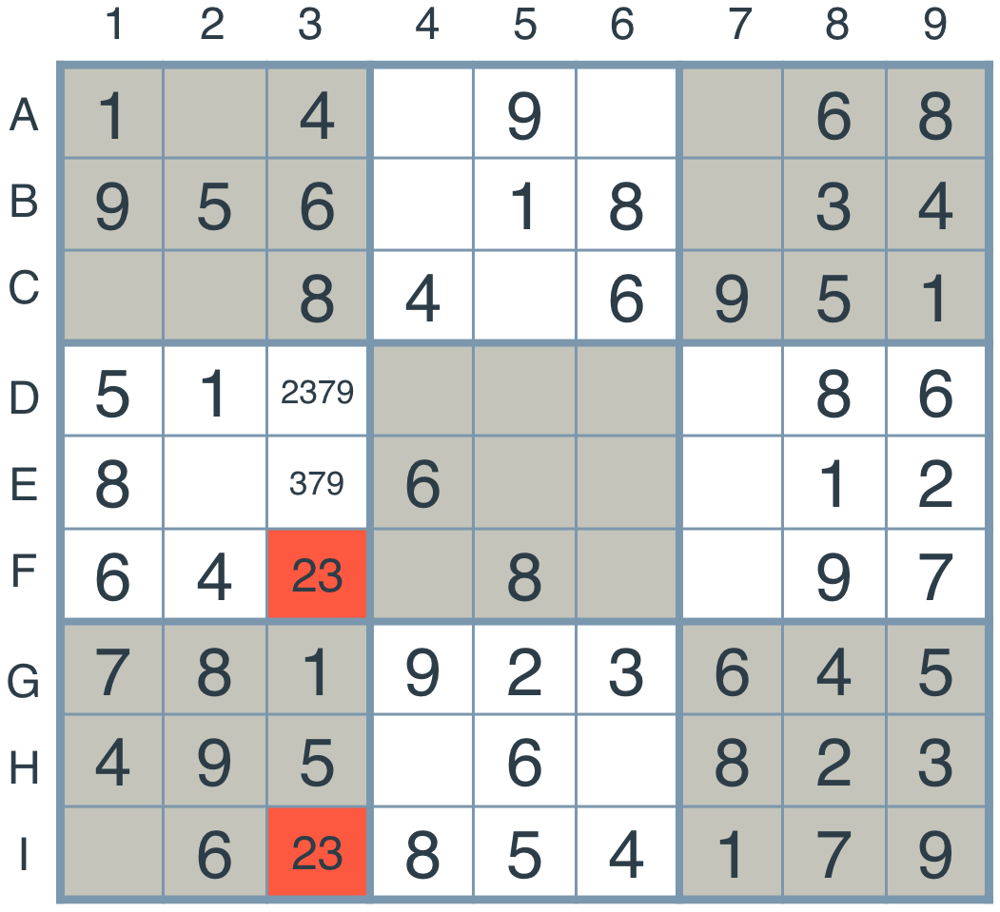

# The Sudoku Solver Project

Congratulations on making it all the way through! You now have a program that can solve any Sudoku puzzle! But can you extend your solution to include more heuristics? How about to solve a modified version of the puzzle?

For this project, you will implement some extensions to the Sudoku algorithm developed in the lectures. The first extension will be an implementation of the **naked twins** technique. The second will be a modification of the algorithm to solve a **diagonal sudoku**.

Navigate to the next page for details on how to get started and submit.

### Naked Twins

The naked twins technique is the following. Consider the following puzzle, and look at the two highlighted boxes, **'F3'** and **'I3'**.

As we can see, both belong to the same column, and both permit the values of 2 and 3. Now, we don't know which one has a 2 and which one has a 3, but we know one thing for sure — the values 2 and 3 are locked in those two boxes, so no other box in their same unit (the third column) can contain the values 2 or 3.

Thus, we go over all the boxes in their same unit, and remove the values 2 and 3 from their possible values.

As you can see, we've removed the values 2 and 3 from the boxes 'D3' and 'E3'. This is the naked twins technique. In this project, you'll write a function that implements this technique.

### Diagonal Sudoku

A diagonal sudoku is like a regular sudoku, except that among the two main diagonals, the numbers 1 to 9 should all appear exactly once. In this project, you'll modify the functions we've written in the lecture (or you can write your own!) in order to solve every diagonal sudoku.

***

## Instructions

In this project, you will be writing code to implement two extensions of our sudoku solver. The first one will be to implement the technique called "naked twins". The second one will be to modify our existing code to solve a diagonal sudoku. To complete this project you will use the tools you learned about in the lesson, and build upon them.

Your goals are to implement the naked twins function, and write an AI agent that will solve the Diagonal Sudoku game.

1. Clone the [repository](https://github.com/udacity/aind-sudoku).
2. Activate the aind conda environment that you set up in the last lesson.
3. Fill out the functions in solution.py to solve a diagonal sudoku.
4. Fill out the naked_twins function to solve the [Naked Twins problem](http://www.sudokudragon.com/tutorialnakedtwins.htm).
5. Answer the following questions (few sentences) in your Readme.md file:
	- How do we apply constraint propagation to solve the naked twins problem?
	- How do we apply constraint propagation to solve the diagonal sudoku problem?
6. Test that your solution works. Some simple test code is provided (run python solution_test.py), and you are encouraged to write more for yourself. Udacity's Project Assistant will also give you feedback if you execute udacity submit on the command line from within the project directory. (Use pip install udacity-pa to install the project assistant client if you haven't done so already.) You may submit to the project assistant as many times as you like. If you encounter questions or issues while using Project Assistant, please refer to the FAQ.
