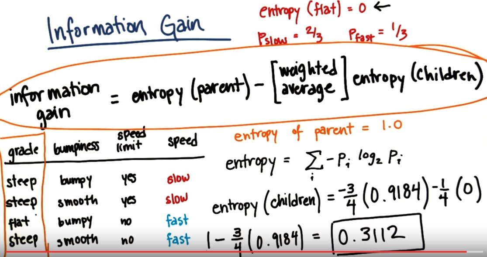

# Data Impurity & Entropy

### Entropy

Controls how a Decision Tree decides where to split the data

**Entropy** is a measure of impurity in a bunch of examples

*Purity* refers to how much of a single class is contained within the data

For example: If you have one data set that has 30% class one and 70% class two, that dataset is less pure than a dataset with 80% class two and 20% class one.

When building a Decision Tree your goal is make the branches of your data as pure as possible.

-

If all data in your dataset is from the same class then Entropy = 0

If your dataset is eavenly split between classes then Entropy = 1.0

#### The formula for Entropy

Entropy = Summation i((Pi) log2(Pi))

Example of a calculation:

***

# Information Gain

**Information Gain** is equal to the (entropy of the parent) - the (weighted average of the entropy of the children)

The Decision Tree Algorithm will maximize information gain

***

### Tuning Criterion Parameter

The **Tuning Criterion Parameter** can be passed to the DecisionTreeConstructor to meaure the quality of the split for us
