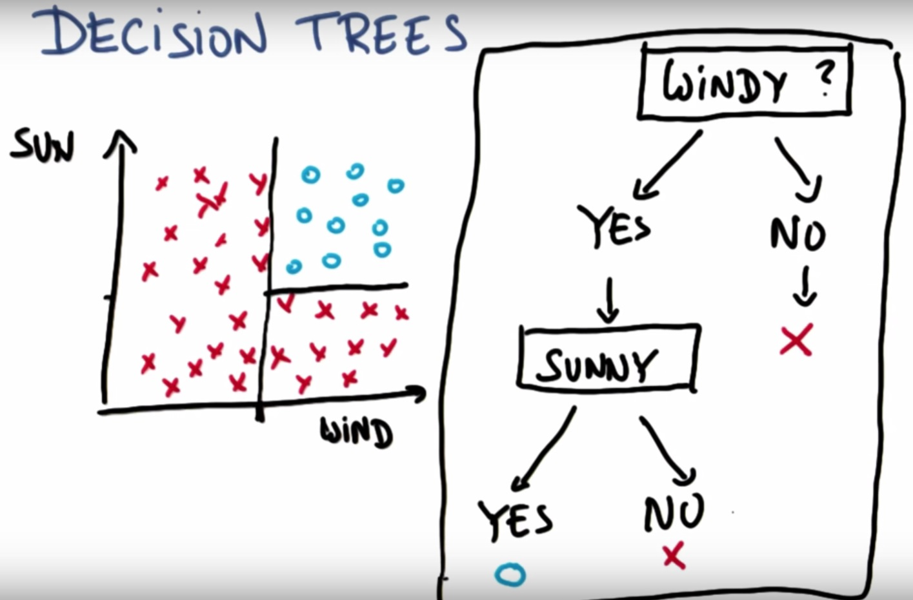
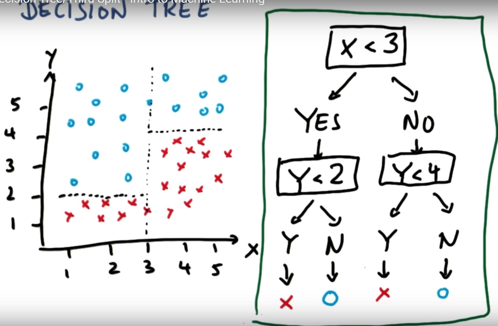

#Decision Trees - Multiple Decision Surfaces

**Decision Trees** is another supervised learning algorithm that uses a trick to let you do non-linear decision making with simple linear decision surfaces

-

Decision Trees do this by allowing you to ask multiple linear questions, one after the other

This allows you to draw a new decision surface for each question that you ask, as seen in the result below

This decision tree allows our program to decide when to go windsurfing based on two questions: Is it sunny? and is it windy? If both of the answers are yes then our program will say that it is a good day to go windsurfing.

Here is another decsion tree where we have three decision surfaces based on the questons we ask
